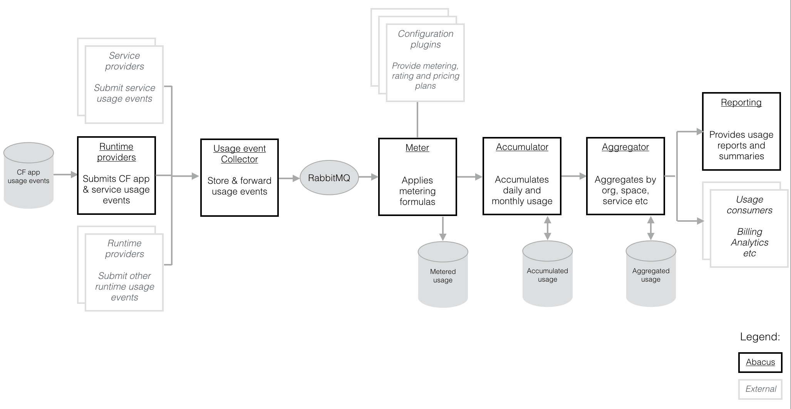

CF-Abacus
===

The Abacus usage metering and aggregation service.

[](https://travis-ci.org/cloudfoundry-incubator/cf-abacus) [](https://coveralls.io/github/cloudfoundry-incubator/cf-abacus?branch=master) [](https://abacusdev-slack.mybluemix.net/) [](https://gitter.im/cloudfoundry-incubator/cf-abacus?utm\_source=badge) [](http://webchat.freenode.net?channels=%23abacusdev)

Overview
---

Abacus provides usage metering and aggregation for [Cloud Foundry (CF)](https://www.cloudfoundry.org) services. It is implemented as a set of REST micro-services that collect usage data, apply metering formulas, and aggregate usage at several levels within a Cloud Foundry organization.

Abacus is implemented in Node.js and the different micro-services can run as CF apps.

This diagram shows the main Abacus services and their role in the processing of usage data. It also shows the services you can deploy around Abacus to integrate it into your Cloud platform.



Abacus provides a REST API allowing Cloud service providers to submit usage data, and a REST API allowing usage dashboards, and billing systems to retrieve usage reports. The Abacus REST API is described in [doc/api.md](doc/api.md).

For presentations related to CF-Abacus, see the [presentations](doc/presentations.md) page.

Frequently Asked Questions (FAQs)
---

The Abacus FAQ can be found in [doc/faq.md](doc/faq.md).

Building
---

Abacus requires Node.js >= 5.11.1 and Npm >= 3.8.6.

```sh
cd cf-abacus

# Bootstrap the build environment, run Babel on the Javascript sources,
# install the Node.js module dependencies and run the tests
npm run build
```

Testing
---

```sh
cd cf-abacus

# Run eslint on the Abacus modules
npm run lint

# Run the tests
npm test
```

Deploying to Cloud Foundry
---

Abacus runs as a set of applications deployed to Cloud Foundry. Each application is configured to run in multiple instances for availability and performance. Service usage data is stored in CouchDB databases.

The following steps assume a local Cloud Foundry deployment created using [Bosh-lite](https://github.com/cloudfoundry/bosh-lite), running on the default local IP assigned by the Bosh-lite CF installation script, and have been tested on CF v226.4. Please adjust to your particular Cloud Foundry deployment environment.

```sh
cd cf-abacus

# Point CF CLI to your local Cloud Foundry deployment and
# create a CF security group for the Abacus apps
bin/cfsetup

# Run cf push on the Abacus apps to deploy them to Cloud Foundry
npm run cfpush

# Check the state of the Abacus apps
cf apps

# You should see something like this
Getting apps in org <your organization> / space <your space>...
OK

name                       requested state   instances   memory   disk   urls   
abacus-usage-collector     started           1/1         512M     512M   abacus-usage-collector.both-lite.com   
abacus-usage-meter         started           1/1         512M     512M   abacus-usage-meter.both-lite.com
abacus-usage-accumulator   started           1/1         512M     512M   abacus-usage-accumulator.both-lite.com   
abacus-usage-aggregator    started           1/1         512M     512M   abacus-usage-aggregator.both-lite.com   
abacus-usage-reporting     started           1/1         512M     512M   abacus-usage-reporting.both-lite.com   
abacus-provisioning-plugin started           1/1         512M     512M   abacus-provisioning-plugin.both-lite.com   
abacus-account-plugin      started           1/1         512M     512M   abacus-account-plugin.both-lite.com   
abacus-pouchserver         started           1/1         1G       512M   abacus-pouchserver.both-lite.com   
```

Running the demo on Cloud Foundry
---

The Abacus demo runs a simple test program that simulates the submission of usage by a Cloud service provider, then gets a daily report for the usage aggregated within a Cloud Foundry organization.

The demo data is stored in a small in-memory [PouchDB](http://pouchdb.com) test database so the demo is self-contained and you don't need to set up a real CouchDB database just to run it.

Once the Abacus apps are running on your Cloud Foundry deployment, do this:

```sh
cd cf-abacus

# Run the demo script
npm run demo -- \
  --collector https://abacus-usage-collector.both-lite.com \
  --reporting https://abacus-usage-reporting.both-lite.com

# You should see usage being submitted and a usage report for the demo organization

```

Running Abacus on localhost
---

The Abacus apps can also run on your local host in a shell environment outside of Cloud Foundry, like this:

```sh
cd cf-abacus

# Start the Abacus apps
npm start

# Wait a bit until all the apps have started

# Run the demo script
npm run demo

# Stop everything
npm stop
```

Metering Cloud Foundry app usage
---

Abacus comes with a CF [bridge](lib/cf/bridge) that acts as a resource provider for Cloud Foundry app runtime usage, reads Cloud Foundry [app usage events](http://apidocs.cloudfoundry.org/runtime-passed/app_usage_events/list_all_app_usage_events.html) and reports usage to the Abacus usage [collector](lib/metering/collector).

In the end the Abacus CF bridge enables you to see runtime usage reports for the apps running on your Cloud Foundry instance. In order to start the CF bridge follow its [README](lib/cf/bridge/README.md).

Layout
---

The Abacus source tree is organized as follows:

```sh

bin/ - Start, stop, demo and cf push scripts

demo/ - Demo apps

    client - demo program that posts usage and gets a report

doc/ - API documentation

lib/ - Abacus modules

    metering/ - Metering services

        collector - receives and collects service usage data
        meter     - applies metering formulas to usage data

    aggregation/ - Aggregation services

        accumulator - accumulates usage over time and applies
                      pricing to accumulated usage
        aggregator  - aggregates usage within an organization and applies
                      pricing to aggregated usage
        reporting   - returns usage reports

    cf/ - CF platform integration

        bridge - collects CF app usage data

    config/ - Usage formula and pricing configuration

    utils/ - Utility modules used by the above

    plugins/ - Plugins for provisioning and account services

test/ - End to end tests

    perf/ - Performance tests

tools/ - Build tools

etc/ - Misc build scripts

```

Developing individual Abacus modules
---

As shown in the above Layout section, Abacus consists of a number of Node.js modules under the [lib](lib) directory.

When developing on Abacus you may want to quickly iterate through changes to a single module, and run the tests only for that module rather than rebuilding the whole project each time.

Here are the steps most of us follow when we work on a single module, using the [collector](lib/metering/collector) module as an example.

First, bootstrap your Abacus development environment:

```sh
cd cf-abacus

# Setup the base Node.js tools and dependencies used by the Abacus build
npm run bootstrap
```

Then install your module's dependencies as usual with npm:

```sh
cd cf-abacus/lib/metering/collector
npm install
```

At this point your development cycle boils down to:

```sh
cd cf-abacus/lib/metering/collector

# Run Babel.js to translate EcmaScript6 Javascript to ES5
npm run babel

# Run ESLint on your code and run the module's unit tests
npm test
```

To run the collector app you can do this:

```sh
cd cf-abacus/lib/metering/collector
npm start
```

To push the app to your Cloud Foundry instance, do this:

```sh
cd cf-abacus/lib/metering/collector
npm run cfpush
```

Finally, to rebuild everything once you're happy with your module:
```sh
cd cf-abacus

# Important to do at this point as the next step does a git clean
git add <your changes>

# Does a git clean to make sure the build starts fresh
npm run clean

# Build and unit test all the modules
npm run build

# Or to run what our Travis-CI build runs, including integration tests
npm run cibuild
```

People
---

[List of all contributors](https://github.com/cloudfoundry-incubator/cf-abacus/graphs/contributors)

License
---

  [Apache License 2.0](LICENSE)
