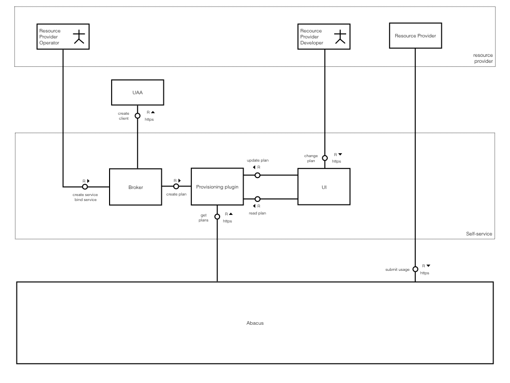

# Architecture



# Roles

We can define two different roles for resource providers:

## Developer
* creates service instance
* binds service instance to Resource Provider
* modifies usage plans
* (code) submits usage
* unbinds service instance
* deletes service instance

## Operator
* deploys Resource Provider
* creates service instance with service-specific plans configuration
* update service instance with service-specific plans configuration
* binds service instance to Resource Provider

# Flows
The Abacus Broker supports the following flows:

## Provision Resource Provider
1. Create service instance

   The `resource_id` is generated by the broker and used in Abacus. This id is global in CF installation/landscape, therefore it is important to be unique. It can be used to submit or retrieve usage later on.

1. Create plans

   The plan id follows the format `<RESOURCE_PROVIDER_ID>-<RESOURCE_ID>`. This provides the ability to discover plans.
   The plans definition could be supplied via a command line parameter and should match the following format.
   ```json
    {
      "plans": [
        {
          "plan": {
            "plan_id": "standard-object-storage",
            "measures": [
              {
                "name": "storage",
                "unit": "BYTE"
              }
            ],
            "metrics": [
              {
                "name": "storage",
                "unit": "GIGABYTE",
                "type": "discrete",
                "meter": "(m) => new BigNumber(m.storage).div(1073741824).toNumber()",
                "accumulate": "(a, qty, start, end, from, to, twCell) => end < from || end >= to ? null : Math.max(a, qty)"
              }
            ]
          }
        }
      ]
    }
   ```
   :exclamation: With the current version only one metering plan is supported. For rating and pricing default sample plans are created. The field `plan_id` is required, but not used yet. In addition to the plan you could also include resource provider specific information. The resource provider section may look like this : 
    ```json
    {
      "plans": [
        {
          "plan": {
            ...
          },
          "resource_provider": {
            "service_name": "ML",
            "service_plan_name": "small"
          }
        }
      ]
    }
   ```
    In order to use this functionality you should implement Service plugin (API is described [here](https://github.com/cloudfoundry-incubator/cf-abacus-broker/blob/7fc9d3e1e7880c8078e03ffb11d585b36655db0e/lib/plugins/provisioning/src/index.js#L308-L361)). 
    In case the parameter is not supplied, all plans are filled with default sample values.

1. Create UAA client

   The UAA client is created with:
   * id `abacus-<resource_id>-<binding_id>`
   * scopes: `abacus.usage.<resource_id>.read` and `abacus.usage.<resource_id>.write`

1. Service instance credentials

   ```
   credentials: {
     client_id: <UAA_CLIENT_ID>,
     client_secret: <UAA_CLIENT_SECRET>,
     collector_url: <COLLECTOR_URL>,
     resource_id: <RESOURCE_ID>,
     plans: [<RESOURCE_PROVIDER_ID>-<RESOURCE_ID>]
   }
   ```

1. Access dashboard

   The broker returns dashboard URL pointing to the UI and containing the service instance ID. For this to work we use a dashboard client, whose credentials are shared between broker and UI. Credentials also contains a `resource_id` and list of plans associated to it.

## Edit plan
1. Via dashboard

    1. Open dashboard
    1. Find all resource providers
      The dashboard does plan discovery by looking up all services created with Abacus broker.
    1. Open plan(s) for resource provider

      Since the service instance id is also the plan id we can directly reach Abacus to fetch the plan and display/edit it.
1. Via command line

    Use the update-service command and provide the configuration parameters matching the format of the [create plans](#provision-resource-provider) above.

## De-provision Resource Provider
1. Delete service instance
1. Delete UAA client
1. Mark plans as deleted

   The plans are not deleted, since Abacus can recieve usage several days after the month ended (depends on `SLACK` setting). The plans are simply marked to be deleted. We can delete the marked-for-deletion plans together with the data after a certain period (usually after 3 to 6 months).
