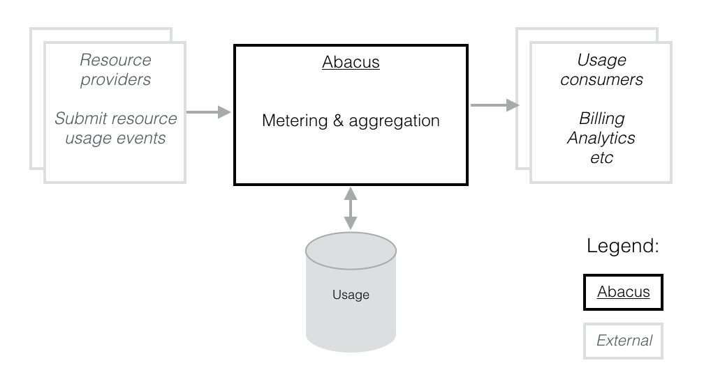
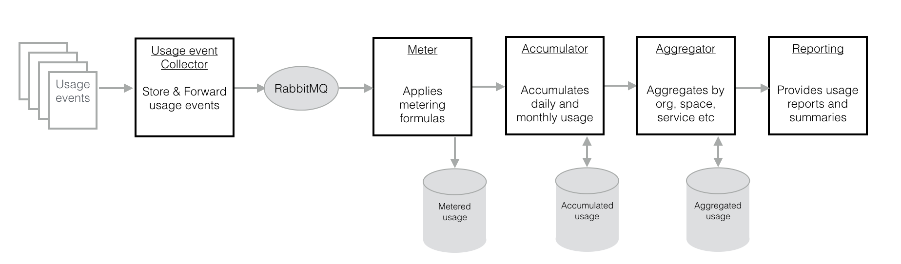

# Abacus

## Overview
Abacus provides usage metering and aggregation for [Cloud Foundry (CF)](https://www.cloudfoundry.org) services. It is implemented as a set of REST micro-services that collect usage data, apply metering formulas, and aggregate usage at several levels within a Cloud Foundry organization.

Abacus provides a REST API allowing Cloud service providers to submit usage data, and a REST API allowing usage dashboards, and billing systems to retrieve usage reports. The Abacus REST API is described in [doc/api.md](doc/api.md).

## Roles
Here is a list of the roles we'll use in the guide:

* **Cloud Foundry Operator**

   The Operator is responsible for the day-to-day operation of Cloud Foundry. A small subset of the responsibilities of the Operator:
   * create/modify resources (organizations, spaces, quotas, services) needed for Abacus or the Resource providers
   * scale Cloud Foundry installation to fit usage requirements
   * update parts of the Cloud Foundry landscape:
       * build packs (new runtimes)
       * stem cells (OS or security fixes)
       * infrastructure services (Diego, ELK)
       * marketplace services

   The responsibilities above are often shared between several teams, organizations and even companies. For example we might have:
   * CloudOps (Amazon, Google Cloud, Azure, OpenStack operation)
   * Cloud Foundry operators (CF operation)
   * DevOps teams (operating infra and user-facing services)

* **User**

   The customer uses software (SaaS), applications (PaaS) or resources (IaaS) from the Cloud Foundry system. The User is charged for the used resources.

* **Abacus Integrator**

   The Abacus integrator is responsible for the correct functioning of the Abacus components. The integrator is also responsible for the integration and functioning of the Abacus pipeline with Cloud Foundry. The integrator takes care to request (from CF Operators), monitor and provision the needed memory, network and database resources for Abacus.
   The integrator also takes care for any integrations with services we can deploy around Abacus, such as monitoring, logging, auditing, BPEM processes, billing system and usage analytics.

* **Resource Provider**

   The Resource Provider, as suggested by the name is responsible for providing resources to the users. To meter the resource usage, each Resource Provider shall submit usage documents to Abacus.

* **Report Consumer**

   The Report Consumer can request an usage report from Abacus. This report can be presented directly to the User or used to feed external systems like monitoring or billing.

   This diagram shows the Provider and Consumer roles:

   


# Abacus pipeline concepts
Abacus is a distributed system built with micro-services. It accepts as input usage events, processes them and generated reports and summaries on request.


Resource providers are responsible to generate the usage events/documents and to submit it to Abacus. Each usage document contains one or more **measures**.

## Measure
**Measure** can be defined as "the determination or estimation of ratios of quantities" [1] or "the extent, dimensions, quantity, etc., of something, ascertained especially by comparison with a standard" [2]

Measures are the raw data that we submit to Abacus. Each measures consists of multiple entries, each of them associated with a name and unit.

Abacus project has an [object store example](https://github.com/cloudfoundry-incubator/cf-abacus/blob/master/lib/plugins/provisioning/src/plans/metering/basic-object-storage.js). Inside we can find several measures:
```javascript
{
  name: 'storage',
  unit: 'BYTE'
},
{
  name: 'light_api_calls',
  unit: 'CALL'
}
```

We can submit to Abacus a measure that has 10 storage units (bytes) and 5 light api calls.

## Metric
While the measures represent the raw data, the metrics combine and derive something out of the data.

As we already said the raw data is submitted to Abacus so it can meter and aggregate the measures into metrics.

In the [object store example](https://github.com/cloudfoundry-incubator/cf-abacus/blob/master/lib/plugins/provisioning/src/plans/metering/basic-object-storage.js) we have several metrics:
```
{
  name: 'storage',
  unit: 'GIGABYTE',
  ....
},
{
  name: 'thousand_light_api_calls',
  unit: 'THOUSAND_CALLS',
  ...
}
```

The metrics above first convert the measures to gigabytes and thousands of calls and then combines them to derive a quantifiable value.

The metrics can produce simple numbers or compound data structures, if they need to keep state, or to perform some complex processing.

### Functions
To combine the measures into metrics a Resource Provider can define 6 Javascript functions: `meter`, `accumulate`, `aggregate`, `rate`, `summarize` and `charge`.

The Abacus processing pipeline is a simple composition that can be expressed like

`charge(…, summarize(…, rate(aggregate(..., accumulate(..., meter(usage)))))))`

The functions usually work with [BigNumber.js](https://github.com/MikeMcl/bignumber.js) to allow higher precision of the result.

#### meter
   A "map" function, responsible for transforming a raw measure into the unit used for metering.
   * input:
      * `m`: submitted measure
   * output metered measure

   In our example, we want to meter thousands of API calls so our meter function will map the measure `x` to `x / 1000`:
   ```javascript
    (m) => new BigNumber(m.storage).div(1073741824).toNumber()).toString()
   ```

The function often does rounding or similar operations as well.

#### accumulate
Accumulate is a "reduce" function, responsible for accumulating metered usage over time.
* input:
   * `a`: accumulated result so far
   * `qty`: current measure
   * `start`: start time of the resource usage
   * `end`: end time of the resource usage
   * `from`: the last time at which the resource instance usage was accumulated. `undefined` if there is no previous accumulated usage for the resource instance by a specific consumer
   * `to`: the time to which the resource instance usage must be accumulated
   * `twCell`: time-window cell
* output: new accumulated result

A typical use is a sum of all metered usage for a resource instance over time.

The function is often implemented as max over the given period of time for example. For example the object store finds the max memory used by the storage:
```javascript
((a, qty, start, end, from, to, twCell) => end < from || end >= to ? null : Math.max(a, qty)).toString()
```

#### aggregate
A "reduce" function, responsible for aggregating usage in Cloud Foundry entities (space and organization), instead of time.
* input:
   * `a`: aggregateed result so far. `undefined` if no usage
   * `prev`: previous aggregateed result
   * `curr`: current measure. `undefined` if usage was rejected by accumulate
   * `aggTwCell`: aggregation time-window cell
   * `accuTwCell`: accumulation time-window cell
* output: new aggregated result

Usually used to add up usage from:
* different service instances under a service,
* all the service instances under a space/app/org, etc

In most cases the function sums the measures as in our object store example:
```javascript
((a, prev, curr, aggTwCell, accTwCell) => new BigNumber(a || 0).add(curr).sub(prev).toNumber()).toString()
```

#### rate
Simple 'map' function, responsible for converting an aggregated usage into a cost. This can be done at various levels: service instance, plan, app, space, org etc.
* input:
   * `price`: price of the usage
   * `qty`: aggregated usage quantity
* output: cost

A typical rate function will just multiply the metered usage by a price to get the cost, but we can also use more sophisticated rate functions for clip levels, pro-rating etc.

The [object store rating plan](https://github.com/cloudfoundry-incubator/cf-abacus/blob/master/lib/plugins/provisioning/src/plans/rating/object-rating-plan.js) uses simple multiplication to get the cost:
```javascript
((price, qty) => new BigNumber(qty).mul(price || 0).toNumber()).toString()
```

#### summarize
A "reduce" function, responsible for summarizing the different types of usage.
* input:
   * `t`: summary so far
   * `qty`: `undefined` if no usage
   * `from`: the last time at which the resource instance usage was summarized. `undefined` if there is no previous summary for the resource instance by a specific consumer
   * `to`: the time to which the resource instance usage must be summarized
* output:

#### charge
A "reduce" function, responsible for charging at various levels: service instance, plan, app, space, org etc.
* input:
   * `t`: charges so far
   * `cost`: cost (from the `rate` function)
   * `from`: the last time at which the resource instance usage was charged. `undefined` if there is no previous charge for the resource instance by a specific consumer
   * `to`: the time to which the resource instance usage must be charged
* output: charge

The [rating plan](https://github.com/cloudfoundry-incubator/cf-abacus/blob/master/lib/plugins/provisioning/src/plans/rating/object-rating-plan.js) uses the cost as charge (does nothing):
```javascript
((t, cost, from, to) => cost ? cost : 0).toString()
````

### Formulas
Formulas are deprecated, under the hood they are converted to `meter` and `accumulate` Javascript functions.

## Plan
Measures and metrics are grouped into single entity - the plan. Plans provide recourse providers with a way to express the relationship between the measures and metrics. If for example we need two measures to be able to calculate the value of a metric we can group the two measures and the metric into a metering plan.

There are 3 plan categories, based on what the plan does: metering, rating or pricing.

### Metering plan
The metering plan defines the metering part of the calculations that Abacus will execute. We can use the `meter`, `accumulate` and `aggregate` functions with a metering plan. Examine the [object storage metering plan](https://github.com/cloudfoundry-incubator/cf-abacus/blob/master/lib/plugins/provisioning/src/plans/metering/basic-object-storage.js).

### Rating plan
A rating plan defines the rating calculations. We can use the `charge` and `rate` functions with a metering plan. We can check our [example rating plan](https://github.com/cloudfoundry-incubator/cf-abacus/blob/master/lib/plugins/provisioning/src/plans/rating/object-rating-plan.js).

### Pricing plan
Define the pricing on per-measure basis. Have a look at our example [pricing plan](https://github.com/cloudfoundry-incubator/cf-abacus/blob/master/lib/plugins/provisioning/src/plans/pricing/object-pricing-standard.js) for more details on the exact format.

## Sample plans
There are several plans that are already predefined in Abacus and we can check them out as examples.

Here are the plans and the metrics contained inside:
* [object storage](https://github.com/cloudfoundry-incubator/cf-abacus/blob/master/lib/plugins/provisioning/src/plans/metering/basic-object-storage.js#L23)
   * storage space
   * number of API calls
* [basic analytics](https://github.com/cloudfoundry-incubator/cf-abacus/blob/master/lib/plugins/provisioning/src/plans/metering/basic-analytics.js)
   * average number of instances
   * number of API calls
* [linux container](https://github.com/cloudfoundry-incubator/cf-abacus/blob/master/lib/plugins/provisioning/src/plans/metering/basic-linux-container.js)
   * memory usage [GB/h]

We already discussed the object storage metrics since we use them as examples in this guide.

The analytics metrics are using deprecated formulas and we can use them as a reference on how to migrate from formulas to the new functions format.

## Metric Types
There are two metric types in Abacus:
* stateless, "historical", "log-like" or **"discrete"**
* stateful or **"time-based"**

Let's see what characterizes the two metric types in Abacus.

### Discrete
These metrics are stateless. They resemble message logs, since we simply submit them to Abacus. When we request an aggregated result from Abacus, it goes through the history of events and performs calculations, based on the defined formulas.

Our object store plan is the typical use-case for discrete metrics. We submit the amount of storage used in the store in a log-like historical manner. Abacus then calculates the total amount spent.

The discrete metrics are usually quite simple and deal with simple numbers in both measures and metrics.

### Time-based
The time-based metrics are stateful. We store the state of the resource instance and use it to calculate the result on request.

The linux-container plan contains the gigabytes **per hour**. The usage is ongoing and grows with the time.

It is important to note that time-based metrics often use compound data structures to keep track of the usage. For example we submit the previous and the current measures of the container resource to calculate the GB/h usage.

#### Sample
The [example time-based plan](https://github.com/cloudfoundry-incubator/cf-abacus/blob/master/lib/plugins/provisioning/src/plans/metering/basic-linux-container.js) measures memory consumption over time.

To start application A with an instance of 1 GB we can submit these measures:
```
current_running_instances: 1,
current_instance_memory: 1073741824,
previous_running_instances: 0,
previous_instance_memory: 0
```

To update A with 1 instance of 1 GB to 2 instances of 2 GB we submit measures:
```
current_running_instances: 2,
current_instance_memory: 2147483648,
previous_running_instances: 1,
previous_instance_memory: 1073741824
```

To stop A:
```
current_running_instances: 0,
current_instance_memory: 0,
previous_running_instances: 2,
previous_instance_memory: 2147483648
```

The algorithm works like this:
* When the app consumed memory in the past before it is stopped (or will consume in the future after it is started), it will add negative consumption
* When the app did not consume memory in the past before it is started (or will not consume in the future after it is stopped), it will add positive consumption

The plan works with out of order data submission and guarantees correctness, given there is no missing usage submission. This basically means that the previous usage has to be submitted together with the current one.

What's more it works only within the time-window, meaning that the calculated numbers would be wrong if:
* The usage is for the period outside of the `from` (start of the month) and `to` (end of the month)
* The earliest event usage submitted for that time period ('from' -> 'to') is not a start (with previous values set to 0)

The metrics internally use a compound data structure consisting of:
* `consuming`: the latest GB (event time)
* `consumed`: the "memory balance" that the app has consumed. The number is relative to the time boundary as described above.

*Example 1:*

Let's go through the formula with a simple example:
1. If a period from 1st to 30th, we have `start=1` and `end=30`
2. An app starts consuming 1 GB on the 20th.
3. `consumed` will be the amount that the app is not consuming (from the start of the month till 20th).
4. The app will consume from 20th till the month end `= 20 - 10 * direction(+1) = 10`

Let's grab a report on the 30th. Then `consumed` will be `the amount that the app has been consuming (start of the month till 30th) + the amount that the app would be idle * direction(-1) / 2 = (10 - 30 + 0) * -1 / 2 = 10.`

*Example 2:*

If there is a stop event on the 25th: `consuming = 0`, then `consumed` will be: `the previous consumed - the amount that the app has been consuming (start -> 25th) + the amount that the app would be idle (25th -> end) = 10 - 25 + 5 = -10 * direction(-1) = 10`

If we grab a report on the 30th, we will calculate Since `consuming` is 0, we will calculate `consumed` as (10) / 2 = 5.

*Example 3:*
Let's use real example of 1 submission:
1. Hour window `from: 1467280800000 (Thu Jun 30 2016 03:00:00 GMT-0700 (PDT))` and `to: 1467284400000 (Thu Jun 30 2016 04:00:00 GMT-0700 (PDT))`
2. `event time: 1467283200000 (Thu Jun 30 2016 03:40:00 GMT-0700 (PDT))`
3. `consuming = 1 GB`
4. We grab the report at the end of the time window (to)
5. the app has been consuming 1 GB for 20 minutes: `1 GB * 20 minutes / 1 hour = 0.33333 GB/h`

The result of this submission in the pipeline would be:
1. `consuming = 1`
2. `consumed = 1 * ((1467280800000 - 1467283200000) + (1467284400000 - 1467283200000)) = -1200000`
3. `since: 1467283200000` (used to keep track of the most up to date consuming)

The `consumed` would be negative because this is relative to the `from` and `to` window. If the event time is > 1/2 of the window, it will results in negative number.
This is fine, because when on report generation, the `summarize` function would make sense of the number.

If we get summary at the end of the window `to: 1467284400000 (Thu Jun 30 2016 04:00:00 GMT-0700 (PDT))`, we will get:
1. `consumed = current consuming * -1 * ((1467280800000 - 1467284400000) + (1467284400000 - 1467284400000)) = 3600000`
2. `summary = (current consumed + consumed) / 2 / 3600000 = (-1200000 + 3600000) / 2 / 3600000 = 0.33 GB/h`

That's exactly the amount the instance consumed in the window: `20 / 60 = 0.33333 GB/h`

#### Carry-over

The time-based usage metrics are carried over into each new monthly database partition by the [cf-renewer](https://github.com/cloudfoundry-incubator/cf-abacus/tree/master/lib/cf/renewer) app. It transfers the active resource consumption from the previous month into the current one.

**Warning:**
The cf-renewer app supports only plans with "pure" time-based metrics. This means that any usage docs with metering plan that has both discrete and time-based metrics will be ignored !

## Time windows
A time window is defined as a range of time covering the boundaries of a specific time to a specific time dimension. For example, `[2015-01-01T00:30:00.000Z, 2015-01-01T00:31:00.000Z]` would be a time window of January 1, 2015 at 12:30 A.M.

Abacus uses time-windows in its report data to provide the clients with info about the usage in several dimensions. These time-windows use UTC time in the dimensions of a second, minute, hour, day, and month.

The windows structure is an array of arrays. The outer array is always five elements that stand for the dimensions that usage would be accumulated to.

The inner array of each of these dimensions is in the format of
```
[
  current time in the dimension unit,
  current time in the dimension unit - 1 dimension unit,
  ...,
  current time in the dimension unit - N dimension units
]
```

If the windows was pulled from January 31st we have an object that looks like this:
```json
[
  [31],
  [1, 1, 1, 1, 1],
  [null],
  [null],
  [null],
]
```

A conceptual representation as a JSON of the above object may look like:
```json
{
  "Month": {
    "0": 31
  },
  "Day": {
    "0": 1,
    "-1": 1,
    "-2": 1,
    "-3": 1,
    "-4": 1
  },
  "Hour": {},
  "Minute": {},
  "Second": {}
}
```

*Note:* the structure above does not exist, it is used to makes things easier to explain. Abacus provides the [timewindow module](https://github.com/cloudfoundry-incubator/cf-abacus/tree/master/lib/utils/timewindow) that has helper functions.

In the month dimension, we have a quantity of 31 for the whole month of January. In the day usage, we have a quantity of 1 for the day of January 31st, 30th, 29th, 28th, and 27th. A null means that there is no quantity in that particular time.

The purpose for keeping track of the previous days in this case is if our system was configured by Abacus Integrator to allow submission of usage up to 5 days late. When usage is retrieved, it has a processed time in milliseconds. Those previous indices are saying "I know of all this usage at the processed time". If Abacus allows submission up to 5 days late, the most up-to-date data we can get on the entire month of January is February 4th.


**Example:** Charting usage

If our x-axis is the time dimension, we may want to consider to what granularity we want to show our data. Is it quantity over an entire month? If so, we would want to use the values from the month dimension. Same for any other dimensions.

If we want to chart the monthly quantity of a particular resource that submits every 4 hours. Given that we have roughly 6 submissions a day, and there’s 31 days in July, that makes around 186 submissions for the month of July for this example.

We'll get events like:
```javascript
{
  ...
  "processed": 1467331200000,
  "windows": [[1], [null], [null], [null], [null]]
  ...
}
```
We can chart the processed time as the x-axis, and the y-axis would take the current month value.

If we assume that with each submission, the quantity for the month is incremented by 1, this would give a linear chart of 186 points where:
* the 1st point has an x-axis of value 1467331200000 and y-axis of value 1
* the last point has an x-axis value of 1470009600000 and y-axis value of 186

# How to submit a usage?

## Example clients
## Security

## Dealing with network issues
### Batching requests
### Retrying requests
### Throttling requests

# Usage report


References
---
[1] Michell, J. (1999). Measurement in psychology: a critical history of a methodological concept. New York: Cambridge University Press.

[2] http://www.dictionary.com/browse/measure
   
