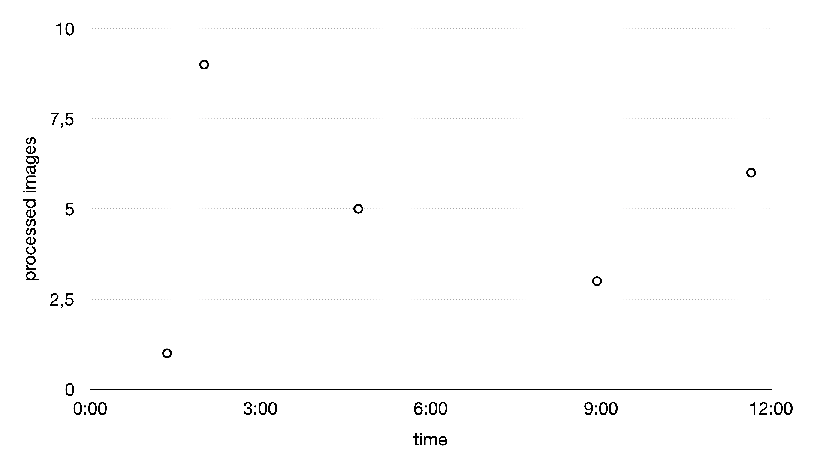
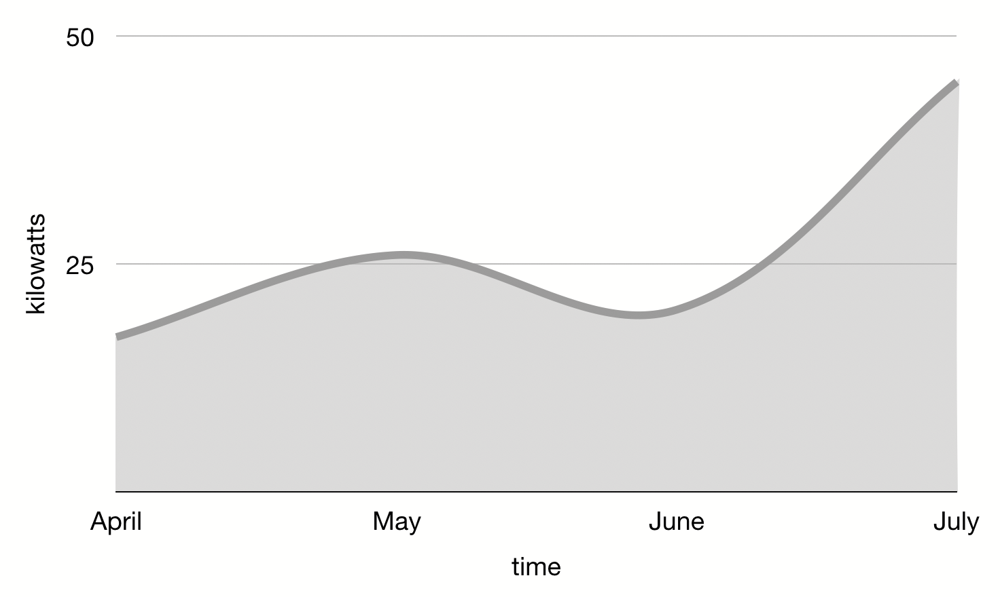
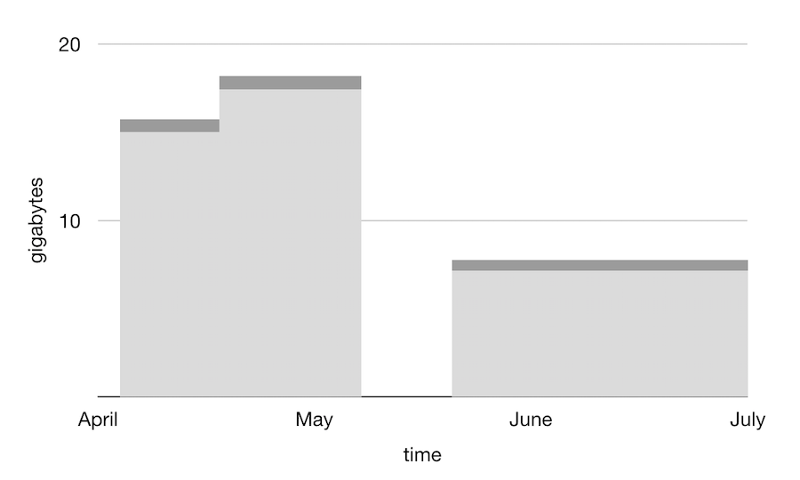
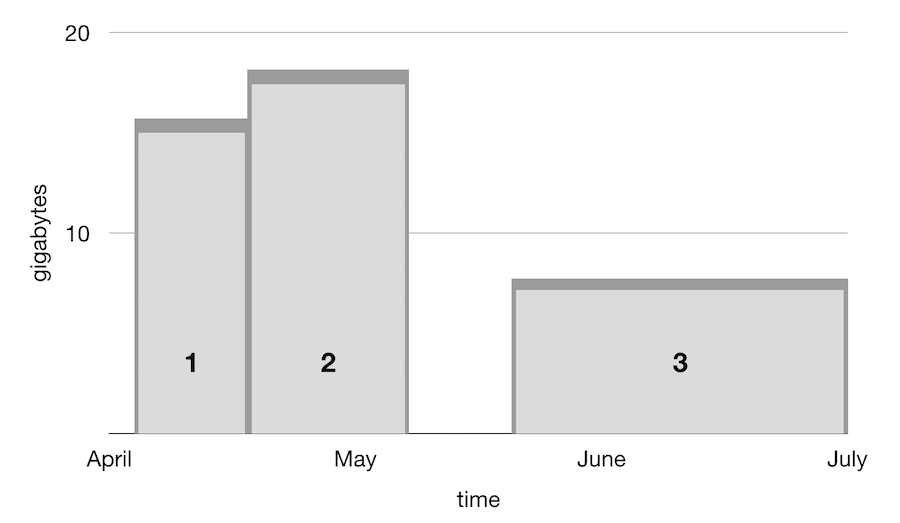
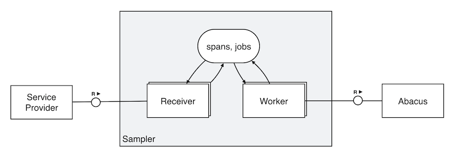
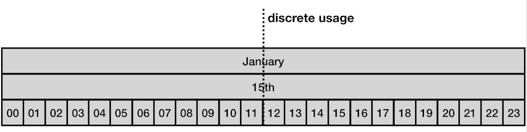
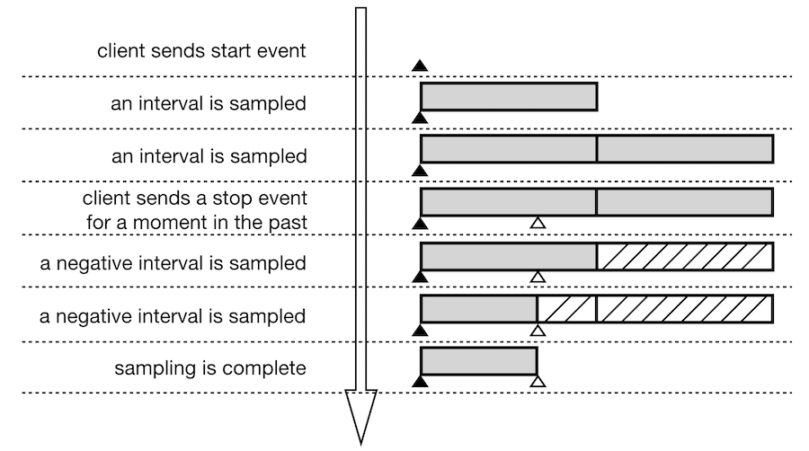
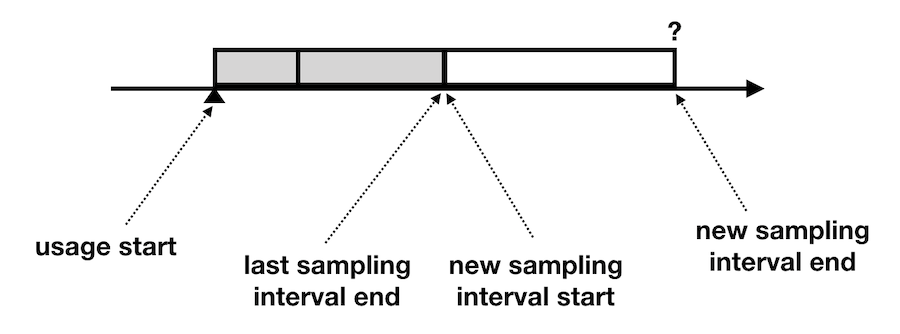
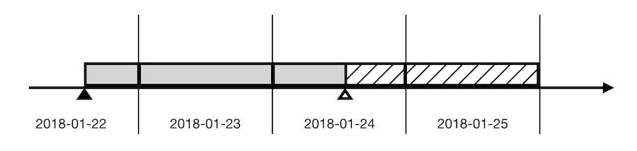

Sampler
=======

## Abstract

Abacus is a cloud metering solution, allowing service providers in a cloud platform to report customer usage. The collected and aggregated data in Abacus can be used to charge said customers through a pay-per-use model.

Here we present Sampler - an extension to Abacus, intended to ease the reporting and processing of continuous (time-based) usages. It achieves that by converting continuous usage data into a series of discrete usage documents and forwarding these documents to the Abacus system. It aims to solve a lot of the problems currently faced when dealing with continuous usages directly in Abacus.

The solution is designed to be highly available, scalable, consistent, and aligned with Cloud Foundry principles and deployment models, while also keeping in sync with the ecosystem (used databases and API concepts) of Abacus. The end goal is to allow for continuous usages to be migrated away from Abacus and into Sampler, so that the core of Abacus can be tuned for maximum discrete usage processing performance and stability.

## 1. Introduction

Abacus enables service providers, also known as *resource providers*, to report and aggregate usage data through the usage of two types of usages:

**Discrete:** These usages deal with independent consumption events, occuring at a specific point in time.

**Continuous:** Also known as *time-based*, these usages represent ongoing consumption that propagates across time.

Historically, Abacus was designed to handle only discrete usage types. The complexity of services and their consumption model, required that continuous usage types be supported as well. However, the data flow and algorithms in place were designed to specifically handle discrete data entries and the support for continuous usages had to be overlayed on top.

The end result was not satisfactory. Continuous usages would produce only correct monthly report aggregations, where daily and hourly would be inconsistent. Resource providers would be required to resubmit continuous usages at start of every month, which required persistency on the client side. Even though usage documents could be submitted out of order, they would need to contain a reference to the previous usage document.

It was clear that the existing implementation had a lot of problems that would be hard to overcome with the existing design. Furthermore, support for continuous usages within Abacus meant that it was much harder to do optimizations and improvements on the discrete usage processing pipeline.

The idea of the Sampler was born. The concept was to move handling of continuous usage documents outside Abacus and into a separate sub-system, allowing for separation of concerns - algorithms for discrete and continuous data processing could evolve independently, as long as the contracts between the systems remained unchanged. Using a new algorithm for processing of continuous usages, meant that a lot of the existing issues could be overcome.

## 2. Discrete Usages

Discrete usages represent a consumption event that can be linked to a single action or event at a specific point in time.

For instance, an image recognition service could charge customers based on the number of processed images. Such a service could send discrete usage documents for each individual image or batch of images processed by its API. Using a `sum` accumulation function in Abacus, the report would contain the total number of processed images.


<br>**Figure 2.1: Discrete usages plotted on a chart**

Discrete usages are characterized by a timestamp and a value. When plotted on a chart, they appear as individual dots, as shown in figure 2.1. The total charge for a given time interval is equal to the sum of the values of all discrete usages within that interval.

```json
{
  "start": 1533254400000,
  "end": 1533254400000,
  "organization_id": "43a8d88a-3ae8-47a8-a82f-f5dd336b1b4c",
  "space_id": "78f79e6a-566c-40bd-aed4-ba129d4b858e",
  "consumer_id": "a1e7d724-b6a8-4efd-bcac-2ee03bf61a72",
  "resource_id": "image-recognition",
  "plan_id": "gpu-classification",
  "resource_instance_id": "982c6024-4f5c-48e8-a64b-cf72d30df7dc",
  "measured_usage": [
    {
      "measure": "image_count",
      "quantity": 3
    }
  ]
}
```
**Figure 2.2: An example discrete usage document**

Usage documents are submitted to Abacus as JSON documents (see figure 2.2). These documents contain the timestamp of the usage, the consumer to be charged, the service that reports the usage, and the amount of resources consumed.

Remark: The existence of both a *start* and an *end* field in the usage document is a legacy API misconception and both values should always be the same. In the long run, they need to be replaced by a single *timestamp* field, something that has been corrected on Sampler side.

The *measured_usage* field contains an array of measures that represent the amount of consumption in raw data. The actual singular value is calculated in Abacus through a metering function (the map function in the map-reduce pipeline). In a way, the chart in figure 2.1 represents documents that have passed the metering function of Abacus.

## 3. Continuous Usages

Continuous usages, also known as *time-based* usages, represent an ongoing service consumption. These usages are characterized by a start timestamp, a series of value updates, and optionally an end timestamp. 


<br>**Figure 3.1: Continuous usage plotted on a chart**

The total charge for a given time interval is equal to the area of the surface formed by the curve and interval boundaries, as shown in figure 3.1.


<br>**Figure 3.2: Continuous usage as seen in Abacus**

In practice, continuous usages in Abacus are never smooth curves, rather a sequence of horizontal lines, as shown in figure 3.2. This is caused by value changes being infrequent, yet instantaneous.

Such usages can easily be described through the usage of three event types:

**Start:** These events indicate the beginning of a continuous usage - its timestamp and initial value.

**Update:** These events specify a change in the value for an existing continuous usage, with the exact timestamp at which the change occurs.

**Stop:** These events indicate the exact timestamp at which an already started continuous usage ends.

Sampler takes a more simplistic approach and bypasses the *update* event. Instead, a pair of *stop* and *start* events with the exact same timestamp can be used to represent that condition.


<br>**Figure 3.3: Continuous usage decomposition**

 This approach decomposes a continuous usage into multiple smaller continuous usages that are all immutable (see figure 3.3). This makes reasoning about the problem much easier and allows for certain optimiziations in the design.

Continuous usage documents are submitted to Sampler through two endpoints. 

```json
{
  "id": "2d509abe-d237-494f-affb-b002757152b7",
  "timestamp": 1533254400000,
  "organization_id": "43a8d88a-3ae8-47a8-a82f-f5dd336b1b4c",
  "space_id": "78f79e6a-566c-40bd-aed4-ba129d4b858e",
  "consumer_id": "a1e7d724-b6a8-4efd-bcac-2ee03bf61a72",
  "resource_id": "image-recognition",
  "plan_id": "gpu-classification",
  "resource_instance_id": "982c6024-4f5c-48e8-a64b-cf72d30df7dc",
  "measured_usage": [
    {
      "measure": "image_count",
      "quantity": 3
    }
  ]
}
```
**Figure 3.4: An example start event document in Sampler**

The first endpoint is used to submit start events, indicating the beginning of a new continuous usage. The payload of the request is very similar to that of a discrete usage in Abacus (see figure 3.4).

The second endpoint is used to submit stop events, indicating the end of an existing continuous usage. The payload scheme is almost identical to that for the *start* events. The only difference is the lack of the *measured_usage* field, as it is inconsequential.

Correlation between *start* and *stop* events is achieved through the *organization_id*, *space_id*, *consumer_id*, *resource_id*, *plan_id*, and *resource_instance_id* fields. These are already the fields used by Abacus to group documents when performing accumulation. In the scope of Sampler, we call the set of these fields *target*.

There is a limitation that stems from this correlation approach. Continuous usage documents for a given target need to be submitted to Sampler in order. It would be very hard to perform proper correlation if two start events are sent for the same target, following a stop event, or when two stop events are sent one after the other. This is why the Sampler server returns an error in such situations.

In case of network or service failures, service providers may want to retry a given start or stop event. They can use the *id* field to specify a GUID that uniquely identifies the request. Sampler server would perform deduplication based on that field and will not report an error for requests marked as duplicate.

An idea to introduce a special *correlation_id* field that could be passed by resource providers or generated by Sampler and then used for correlation was considered. Such an approach would require that a client persist the correlation id for the duration of the continuous usage, which could be indefinite. This increased the complexity on the client side, so for this first iteration we opted for correlation based on the target fields.

Remark: The persistent storage design of Sampler does make use of a *correlation_id* concept. Implementing a *correlation_id* concept in the REST API of Sampler in a future version should be easily achievable.

## 4. Components

The Sampler solution is split into two applications - a *Receiver* and a *Worker*. These two applications communicate with each other through a shared database storage (see figure 4.1).


<br>**Figure 4.1: Sampler components**

The Receiver application implements the REST API of Sampler and handles all inbound requests by service providers. It uses the shared storage to persist new continuous usages or update existing ones. All operations are synchronous in nature.

The requirements for the Receiver application are significant in terms of concurrency, high availability, scalability, and zero down time updates. All of these have been met by keeping the Receiver stateless and managing data in the shared storage.

The Worker application performs the conversion from continuous usages to discrete ones. It polls the shared storage for documents that require processing, runs the conversion algorithm, and sends discrete usages to Abacus. It uses the shared storage to track its progress. The Worker is also responsible for cleaning up old data.

The Worker is asynchronous in nature, since processing of continuous usages is decoupled from them being started or stopped. Similarly, clean up operations can be delayed in time. This reduces the requirements on the Worker application. A short downtime is acceptable, as the Worker can catch up with any pending tasks once its up and running. As a consequence, the application need not be highly available as long as it is recovered by the platform on failure.

Both applications have a strict requirement for data consistency. Inconsistent or incomplete billing-relevant data is not acceptable. To achieve that, all instances of both applications communicate through the data in the shared storage. Modifications to shared entries in the database are performed through optimistic concurrency control, which allows a form of synchronization.

The storage used for the Sampler implementation is MongoDB. There are storages that would probably fit better for the targeted scenario. MongoDB was already the leading storage used by Abacus and we wanted to keep Sampler aligned with existing Abacus dependencies.

## 5. Sampling

The Sampler uses a *sampling* algorithm to convert continuous usages to series of discrete ones. It involves splitting a continuous usage into multiple intervals and sending a descrete usage for each interval to Abacus with a value equal to the surface area of that interval.

Remark: The *sampling* algorithm, from which Sampler got its name, is a known approach in signal processing and served as inspiration for Sampler. In reality, the actual logic in Sampler is closer to how integrals are solved. In retrospect, a better name for the algorithm would have been *integration*.


<br>**Figure 5.1: Usage sampling**

Sampler uses the midpoint of each interval as the timestamp of the respective discrete usage. This makes it easy to determine the Abacus accumulation bucket in which the discrete usage will be stored, even when performing sampling in reverse direction (more on that later).

It is infeasible for Sampler to constantly send discrete usages to Abacus. This would create an immense load on the system and network as well as result in undeterministic storage usage. This is why sampling is normally performed at regular intervals - months, days, hours, etc. 

As a consequence, reports in Abacus are eventually consistent, as Sampler would wait for the whole interval duration to elapse before sending a usage for it. Additionally, the interval length selection determines how granular the final report will be. For instance, if a daily interval is used, the report will contain correct data in the monthly and daily windows, however, the hourly and smaller windows will be incorrect, as the usage value will be concentrated in only one of them, instead of being spread out (see figure 5.2).


<br>**Figure 5.2: Sampling granularity**

It may be the case, because of network latency, downtime, or any other reason, that the resource provider sends a *stop* event with some delay. In such situations it is possible that Sampler has oversampled. It must then perform reverse (or negative) sampling to correct the total result in Abacus by sending discrete usages with negative value, overlapping any oversampled time ranges (see figure 5.3).


<br>**Figure 5.3: Negative sampling sequence**


### 5.1. Interval Area Calculation

The sampling algorithm requires that discrete usages sent to Abacus represent the surface area of the interval they are based on. While this is true, Sampler does not actually calculate this area. Instead, it leaves that to the metering function in Abacus, which is already designed to perform map (as in map-reduce) transformations.

To allow for that, Sampler appends an additional measure to the existing *measured_usages* array containing the length of the interval in milliseconds (see figure 5.4).

```json
{
  "...": "...",
  "measured_usage": [
    {
      "measure": "instances",
      "quantity": 8
    },
    {
      "measure": "memory",
      "quantity": 512
    },
    {
      "measure": "duration",
      "quantity": 7200000
    }
  ]
}
```
**Figure 5.4: Discrete usage measures as sent by Sampler**

Using the metering function in Abacus allows for more complex surface calculations. By having the interval length (*duration* field) in milliseconds it is possible to convert the usage to any desired rate (i.e. metric-hours, metric-minutes) Figure 5.5 shows an example metering function that calculates memory-hours for applications in Cloud Foundry. 

```js
(m) => {
  const durationHours = new BigNumber(m.duration).div(3600000);
  const appMemoryGB = new BigNumber(m.instances).mul(m.memory);
  return new BigNumber(durationHours).mul(appMemoryGB).toNumber();
}
```
**Figure 5.5: Metering function for area calculation**

In addition, this enables Sampler to perform sampling at multiple granularities - months, hours, minutes, so on, as well as send usages for intervals of size smaller than the selected granularity, usually required when handling continuous usage boundaries.

Going in this direction has allowed us to not only support more complex scenarios, but has also relieved Sampler of the need to evaluate custom resource provider functions, something that can be delicate and that Abacus is already designed to handle.

### 5.2. Interval Selection

A key aspect for the correct operation of the sampling algorithm is the selection of the sampling intervals. For each continuous usage that is not yet fully sampled, Sampler keeps track in persistent storage the moment in time up to which the usage has been sampled. The new sampling interval starts from this moment but Sampler needs to determine the end (see figure 5.6).


<br>**Figure 5.6: Interval end selection**

When picking the new sampling interval end, Sampler needs to take multiple aspects into consideration, like granularity and continuous usage stop timestamp.

Using the naive approach of using the current time as the sampling interval end does not work, as the discrete usage for that interval will end up in an arbitrary accumulation window. Instead, intervals are selected to never cross granularity boundaries, regardless of the sampling direction, making accumulation accurate up to that granularity level (see figure 5.7).


<br>**Figure 5.7: Sampling interval sequence**

The interval selection algorithm works as a state machine. It has predefined behaviors for all possible scenarios and the actions are guaranteed to eventually bring the execution to an end.

## 6. Storage Model

The most complex and critical part of Sampler is the storage model. It is the heart of the system and is responsible for persisting resource provider usages and enabling synchronization and communication between applications at any scale.

The Sampler uses a single MongoDB document per continuous usage. These documents are internally called *spans*. An example of a span is shown on figure 6.1.

```json
{
  "_id": "82642ab7-7cc2-46a6-a0e2-bff28fe78d1c",
  "target": {
    "organization_id": "b4263666-d766-47de-8022-07a09a5fea33",
    "space_id": "ff256d6b-e180-4d44-980c-c6e707a69d67",
    "consumer_id": "457ddac3-d856-46ff-b79e-f3a004f14600",
    "resource_id": "postgres",
    "plan_id": "large",
    "resource_instance_id": "a7d722ca-6236-4b79-82dd-c13dd1927429",
    "correlation_id": "33485521-0ffd-40b5-94d4-5fe87347aa87"
  },
  "measured_usage": [
    {
      "quantity": "memory",
      "measure": 512
    }
  ],
  "start": 1540211419000,
  "start_dedup_id": "1f9b525c-6a15-4e73-b9ba-72963436334f",
  "end": 1540215019000,
  "end_dedup_id": "01f8d528-4e93-420b-a042-e200fc383cd0",
  "processing": {
    "complete": false,
    "last_interval": {
      "start": 1540211419000,
      "end": 1540211419000
    },
    "planned_interval": {
      "start": 1540211419000,
      "end": 1540215019000,
      "usage_guid": "769e31ee-f554-4eb2-8c1d-45217bc71399"
    },
    "last_change_at": 1540222219000,
    "version": 1
  }
}
```
**Figure 6.1: Example span**

The purpose and lifecycle of each field is summarized in table 6.2.

| Field | Immutable | Optional | Description |
| ----- | --------- | -------- | ----------- |
| _id | yes | no | Automatically assigned by MongoDB, it uniquely identifies the MongoDB document. |
| target.organization_id | yes | no | The continuous usage *organization_id*. |
| target.space_id | yes | no | The continuous usage *space_id*. |
| target.consumer_id | yes | no | The continuous usage *consumer_id*. |
| target.resource_id | yes | no | The continuous usage *resource_id*. |
| target.plan_id | yes | no | The continuous usage *plan_id*. |
| target.resource_instance_id | yes | no | The contiinuous usage *resource_instance_id* |
| target.correlation_id | no | no | A GUID used to differentiate between different decomposed usages of the same continuous usage target. |
| measured_usage | yes | no | The continuous usage *measured_usage*. |
| start | yes | no | The start timestamp of the continuous usage in milliseconds since epoch. |
| start_dedup_id | yes | yes | A GUID that can be used for start event deduplication. |
| end | no | yes | The stop timestamp of the continuous usage in milliseconds since epoch. If the usage has not been stopped, this field is set to *null*. |
| end_dedup_id | yes | no | A GUID that can be used for stop event deduplication. |
| processing.complete | no | no | Indication whether the continuous usage requires any further sampling. |
| processing.last_interval | no | no | An object describing the last interval that was processed by the sampler. |
| processing.planned_interval | no | yes | An object describing the interval that is planned for sampling. |
| processing.last_change_at | no | no | The timestamp in milliseconds since epoch of the last modification done to the *processing* section. Used for debugging purposes. |
| processing.version | no | no | An integer used for optimistic concurrency control when modifying the *processing* section. |
<br>**Table 6.2: Span fields**

There are a few MongoDB indices that optimize searches over span documents and impose restrictions on the fields. These are summarized in table 6.3.

| Index | Fields | Unqiue | Sparse | Description |
| ----- | ------ | ------ | ------ | ----------- |
| unique_target | *target.organization_id* <br>*target.space_id*<br>*target.consumer_id*<br>*target.resource_id*<br>*target.plan_id*<br>*target.resource_instance_id*<br>*target.correlation_id* | yes | no | Ensures that there may be only one document with a given *target* field-set in MongoDB |
| unique_start_dedup_id | *start_dedup_id* | yes | yes | Ensures that two documents with the same *start_dedup_id*, if specified, cannot be stored in MongoDB. |
| unique_end_dedup_id | *end_dedup_id* | yes | yes | Ensures that two documents with the same *end_dedup_id*, if specified, cannot be stored in MongoDB. |
| search_processing | *processing.complete*<br>*processing.last_interval.end* | no | no | Allows for fast searches when looking up spans that need to be sampled. |
<br>**Table 6.3: Span indices**

There are a number of key execution flows that components in Sampler follow to modify the state of the span documents.

## 6.1. Starting a span

This flow is executed whenever a new continuous usage is started via the start event endpoint of Receiver. A span to represent the submitted continuous usage is created and stored in MongoDB. Figure 6.4 shows an example of a started span.

```json
{
  "_id": "82642ab7-7cc2-46a6-a0e2-bff28fe78d1c",
  "target": {
    "organization_id": "b4263666-d766-47de-8022-07a09a5fea33",
    "space_id": "ff256d6b-e180-4d44-980c-c6e707a69d67",
    "consumer_id": "457ddac3-d856-46ff-b79e-f3a004f14600",
    "resource_id": "postgres",
    "plan_id": "large",
    "resource_instance_id": "a7d722ca-6236-4b79-82dd-c13dd1927429",
    "correlation_id": "33485521-0ffd-40b5-94d4-5fe87347aa87"
  },
  "measured_usage": [
    {
      "quantity": "memory",
      "measure": 512
    }
  ],
  "start": 1540211419000,
  "start_dedup_id": "1f9b525c-6a15-4e73-b9ba-72963436334f",
  "end": 1540215019000,
  "end_dedup_id": "01f8d528-4e93-420b-a042-e200fc383cd0",
  "processing": {
    "complete": false,
    "last_interval": {
      "start": 1540211419000,
      "end": 1540211419000
    },
    "last_change_at": 1540222219000,
    "version": 1
  }
}
```
**Figure 6.4: Started span**

The *_id* field is automatically generated by MongoDB.

The usage related fields in *target* are exactly the same, as specified in the continuous usage document submitted on the start event endpoint. The *target.correlation_id* is set to the zero GUID (00000000-0000-0000-000000000000).

The *measured_usage* array is set to the value in the start event.

The *start* value is equal to the start event *timestamp*. If the event specifies a deduplication *id*, then that value is set in the *start_dedup_id* field, otherwise the field is omitted.

The *end* field is initialized to *null* to indicate that this continuous usage has not been stopped yet, hence is ongoing.

The *processing.complete* field is initialized to *false*, as no sampling has been done already nor has the usage been stopped.

The *processing.last_interval* is initialized to contain a zero length interval positioned exactly at the *start* timestamp. An alternative would have been to set this field to *null*, though the current approach makes sampling code simpler.

The *last_change_at* value is initialized to the clock of the Receiver at the moment of preparing the span document.

The *version* is initialized to *1* to facilitate optimistic concurrency control.

---

The *target.correlation_id* is set to the zero GUID to indicate that the document is in the started state. Since two starts events are not allowed for the same usage target, an attempt to insert another span with the same target will result in an error returned by MongoDB, due to the *unique_target* index. The Receiver then checks whether there is a span in MongoDB with a *start_dedup_id* equal to the *id* field in the event payload. If there is one, then this is a retry attempt from the resource provider and Receiver ignores it, otherwise it returns an error.

## 6.2. Stopping a span

This flow is executed whenever an existing continuous usage is stopped via the stop event endpoint of Receiver.

This is achieved via the *findAndModify* operation in MongoDB. The condition for the update is that there is a document in MongoDB that has a zero *target.correlation_id*, the same *target* fields as those in the stop event, and an *end* field that is *null*. The update operation sets the *end* field to the *timestamp* field of the stop event, the *end_dedup_id* field to the *id* fiield of the stop event, if one is present, and modifies the *target.correlation_id* to a random GUID.

The resulting span then looks as shown in digure 6.5.

```json
{
  "_id": "82642ab7-7cc2-46a6-a0e2-bff28fe78d1c",
  "target": {
    "organization_id": "b4263666-d766-47de-8022-07a09a5fea33",
    "space_id": "ff256d6b-e180-4d44-980c-c6e707a69d67",
    "consumer_id": "457ddac3-d856-46ff-b79e-f3a004f14600",
    "resource_id": "postgres",
    "plan_id": "large",
    "resource_instance_id": "a7d722ca-6236-4b79-82dd-c13dd1927429",
    "correlation_id": "00000000-0000-0000-0000-000000000000"
  },
  "measured_usage": [
    {
      "quantity": "memory",
      "measure": 512
    }
  ],
  "start": 1540211419000,
  "start_dedup_id": "1f9b525c-6a15-4e73-b9ba-72963436334f",
  "end": 1540215019000,
  "end_dedup_id": "01f8d528-4e93-420b-a042-e200fc383cd0",
  "processing": {
    "complete": false,
    "last_interval": {
      "start": 1540211419000,
      "end": 1540211419000
    },
    "last_change_at": 1540222219000,
    "version": 1
  }
}
```
**Figure 6.5: Stopped span**

By modifying the *correlation_id* to a random GUID, the Receiver allows a new span to be started for the same usage target with a zero GUID.

If the update condition fails, then either this is a retry call, and the previous attempt already modified the document, or the resource provider is sending events out of order. The Receiver searches for documents in MongoDB that have an *end_dedup_id* field equal to the *id* field in the stop event to differentiate between the two scenarios and to respond accordingly.

## 6.3. Looking for completed spans

This flow is executed by the Sampler Worker as part of its housekeeping duties. The logic is that any spans marked as completed can be safely deleted by the Worker.

The query searches for any spans that have the *processing.completed* field equal to *true* and a *processing.last_interval.end* field with a timestamp older than a given preconfigured duration. While the former condition is sufficient, the latter allows for a retention period.

## 6.4. Looking for incomplete spans

This flow is executed by the Worker to look for spans that need sampling.

The query searches for any spans that have the *processing.complete* field equal to *false* and a *processing.last_interval.end* field with a timestamp older than the granularity size. The latter is used to control the frequency at which the Worker performs sampling operations.

Documents returned by the query are limited to a certain amount to reduce load on the database. Additionally, query offsets (skip) can be used to run multiple Workers in parallel so that the spans they get don't overlap.

## 6.5. Planning of a sampling interval

To properly handle the case where two Workers may attempt to handle the same document in parallel, the sampling process is split into two phases - planning and execution. This ensures that multiple concurrent Workers can agree on the interval that needs to be sampled and the usage to be submitted to Abacus, regardless of their sampling configurations and apparent state of the world.

Spans returned from a lookup operation (see section 6.4) are checked for a *processing.planned_interval* section. If that field has a value of *null*, then the span undergoes a planning flow.

During the planning flow, the Worker executes the sampling algorithm. It uses the values in *end* and *processing.last_interval_end* to determine the newly planned interval. It then executes a conditional update in MongoDB aiming to set the *processing.planned_interval* field, the *processing.last_change_at* field, and increment *processing.version* by one. The condition for the update is that the *processing.version* field equals the version that the given Worker has last observed (i.e. no other Worker has modified the document in between).

This ensures that even if two Workers are attempting to plan the same span, only one of them will be successful. The Worker that receives an optimistic concurrency control error during update can just ignore it, knowing that this has been handled by a parallel process.

Figure 6.6 shows an example of a planned span.

```json
{
  "_id": "82642ab7-7cc2-46a6-a0e2-bff28fe78d1c",
  "target": {
    "organization_id": "b4263666-d766-47de-8022-07a09a5fea33",
    "space_id": "ff256d6b-e180-4d44-980c-c6e707a69d67",
    "consumer_id": "457ddac3-d856-46ff-b79e-f3a004f14600",
    "resource_id": "postgres",
    "plan_id": "large",
    "resource_instance_id": "a7d722ca-6236-4b79-82dd-c13dd1927429",
    "correlation_id": "33485521-0ffd-40b5-94d4-5fe87347aa87"
  },
  "measured_usage": [
    {
      "quantity": "memory",
      "measure": 512
    }
  ],
  "start": 1540211419000,
  "start_dedup_id": "1f9b525c-6a15-4e73-b9ba-72963436334f",
  "end": 1540215019000,
  "end_dedup_id": "01f8d528-4e93-420b-a042-e200fc383cd0",
  "processing": {
    "complete": false,
    "last_interval": {
      "start": 1540211419000,
      "end": 1540211419000
    },
    "planned_interval": {
      "start": 1540211419000,
      "end": 1540215019000,
      "usage_guid": "769e31ee-f554-4eb2-8c1d-45217bc71399"
    },
    "last_change_at": 1540222219000,
    "version": 2
  }
}
```
**Figure 6.6: Planned span**

The *processing.planned_interval.usage_guid* field is initialized to a random GUID and is vital during the execution flow (see section 6.6).

An important corner case during the planning phase is when the *end* field equals the *processing.last_interval.end* field. This means that the span has been fully sampled and instead of planning a new interval, the Worker, through a conditional update, instead sets the *processing.complete* field to *true*, ending any further processing for this span.

## 6.6. Execution of a sampling interval

Spans returned from the lookup flow (see section 6.4) that have the *processing.planned_interval* field set are subject to the execution flow.

During execution, a Worker would prepare a discrete usage document and submit it to Abacus. It is important that the *processing.planned_interval.usage_guid* is used as the usage deduplication id to Abacus. This ensures that if two Workers are executing the same span and sending usages to Abacus, only one of the usages will be accepted and the other would be treated as a duplicate.

If successful, the Worker then performs a conditional update to try and set the *processiing.last_interval* to the currently executed interval and *processing.planned_interval* back to *null*, redirecting the usage again through the planning phase. As before, the *version* field is used as the condition for the update.

## 7. Conclustion

In this document we have introduced Sampler, a continuous usage processing subsystem. We have looked at the algorithms behind it and the problems it had to solve.

Our long term goal is that any continuous usages in Abacus are migrated to Sampler, allowing for a potential redesign and future improvements in the discrete processing pipeline of Abacus.

